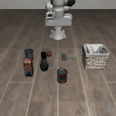
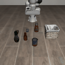
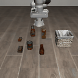

# See-Plan-Act

A LIBERO robot manipulation project on the `libero_object` benchmark (10 pick-and-place
tasks). Three stages, each building on the last:

1. **Behavioral cloning (BC)** on human demonstrations, the frozen base policy everything else builds on.
2. **Residual PPO**, a small correction head trained on top of the frozen BC policy with reinforcement learning.
3. **Residual SAC + distillation (PLD)**, one specialist per task trained with off-policy RL, then folded back into a single policy.

The short version of the result: per-task specialists clearly beat both baselines, but
folding them back into one deployable policy loses most of that gain. Full numbers and
the reason why are in the [Results](#results) and [Conclusion](#conclusion) sections.

## 1. Behavioral cloning

`train_bc.py` trains the base policy on human demonstrations.

```
Per step:
  camera images ──→ ResNet18 (frozen + LoRA) ──→ 2 visual tokens (512-d)
  camera images ──→ CLIP ViT-B/32 (frozen + LoRA) ──→ 2 visual tokens (512-d)
  proprio (9-d) ──→ linear projection ──→ 1 token
  language instr ──→ CLIP text (frozen + LoRA) ──→ 1 token

  all 6 tokens ──→ LSTM (2-layer, 512 hidden) ──→ compressed history token

  [history, vis x4, proprio, lang] ──→ transformer decoder ──→ 8-step action chunk
```

Key features:
- **Action chunking** (k=8): predicts 8 future actions per step.
- **LoRA adapters**: lightweight adaptation of the frozen ResNet/CLIP features (rank 32).
- **LSTM temporal memory**: hidden state carried across steps.
- **Temporal ensembling** at eval time: blends overlapping chunk predictions from recent
  steps (ACT-style), which turns out to matter a lot, see below.
- **Auxiliary done prediction**: a secondary head predicts task completion.

```bash
python train_bc.py --demo_dir ../../libero/datasets/libero_object --epochs 200
```

Saves to `checkpoints/bc_best_seed<N>.pt`.

## 2. Residual PPO

`train_ppo.py` freezes the BC policy entirely and trains a small FiLM-conditioned residual
head on top: `action = base_action + residual(features, language)`. The residual head is
zero-initialized, so training starts bit-for-bit identical to the frozen BC policy and can
only improve on it.

```bash
python train_ppo.py --bc_checkpoint checkpoints/bc_best_seed42.pt \
    --suite libero_object --task_ids 0 --updates 200
```

This worked, but showed the classic on-policy problem: a run climbs to a peak and then
declines if left running past it. A regression-reload mechanism (revert to the best
checkpoint and reset the optimizer once eval falls meaningfully below the best seen)
controls this reliably, but PPO's sample inefficiency still limits how much correction it
can learn from a sparse terminal reward.

## 3. Residual SAC + distillation (PLD)

Modeled on [PLD: Probe, Learn, Distill](https://arxiv.org/abs/2511.00091), the closest
published match for this frozen-base-plus-residual setup. Three parts:

- **`train_sac.py`**: one off-policy SAC specialist per task, same residual idea as PPO but
  with a twin-Q critic, entropy auto-tuning, and a replay buffer. A hybrid probing rollout
  lets the frozen base drive a random-length prefix of each episode before the specialist
  takes over, so training data better matches the base's real deployment behavior.
- **`harvest_rollouts.py`**: runs each trained specialist on its own task and records its
  successful rollouts.
- **`distill_lora.py`**: pools all 10 specialists' rollouts and fine-tunes the frozen BC
  policy's existing LoRA adapters on them, folding everything back into one checkpoint that
  drops straight into `eval.py`/`benchmark_eval.py` like any other BC checkpoint.

```bash
python train_sac.py --bc_checkpoint checkpoints/bc_best_seed42.pt --task_ids 0 --updates 200
python harvest_rollouts.py --bc_checkpoint checkpoints/bc_best_seed42.pt \
    --sac_checkpoint checkpoints_sac/task0/residual_sac_seed42_best.pt --task_ids 0
python distill_lora.py --bc_checkpoint checkpoints/bc_best_seed42.pt \
    --shard_dir rollout_shards --save_path checkpoints/bc_distilled.pt
```

## Results

All numbers below except the specialists are from `benchmark_eval.py`'s full protocol: 50
trials per task on LIBERO's fixed, official init states.

| Approach | Macro-avg success rate | Notes |
|---|---|---|
| BC baseline | 47.0% | frozen base, no RL |
| Residual PPO (best) | 52.4% | in-training eval peaked at 63% on 10 trials/task, the number above is the full 50-trial re-check |
| Residual SAC specialists (avg of 10) | 71% | 10 trials/task, one specialist per task, not distilled |
| Distilled (rank 32) | 48.2% | all 10 specialists pooled into one checkpoint |
| Distilled (rank 64) | 45.6% | same, with double the LoRA capacity |

Per-task breakdown of the rank-32 distilled result, since the average hides what's actually
going on:

| Task | 0 | 1 | 2 | 3 | 4 | 5 | 6 | 7 | 8 | 9 |
|---|---|---|---|---|---|---|---|---|---|---|
| Success rate | 80% | 42% | 64% | 56% | 54% | 64% | **2%** | 50% | 10% | 60% |

Tasks 6 and 8 collapse almost completely. Excluding just those two, the other 8 tasks
average 58.75%, ahead of both baselines. Doubling the LoRA rank (64 instead of 32) didn't
fix this and made the overall average slightly worse, task 8 actually dropped to 0%. Since
more capacity didn't help, this isn't a "bottleneck too small" problem, it looks more like
some tasks' specialist behavior genuinely conflicts with what the shared adapter learns for
the other 9.

## Example rollouts

Alphabet soup task, a clean success (BC baseline):



BBQ sauce task, another success:



Butter task, a failure, this is the task that collapses hardest after distillation:



## Conclusion

The per-task SAC specialists work. Trained individually, with no compromises for sharing,
they clearly beat both the plain BC baseline and the best PPO run. That confirms the core
premise behind trying PLD in the first place: an off-policy specialist per task, probing
around the frozen base's own behavior, learns a better correction than a single joint policy
fighting sample inefficiency across 10 tasks at once.

Where it falls short is the distillation step. Folding all 10 specialists back into one
LoRA adapter loses most of that advantage, and not evenly: 8 of the 10 tasks land close to
or above the baselines, while 2 collapse to near zero. That's not a bug in the data or the
training loop, both were checked directly. It's a real capacity/interference problem in
sharing one small adapter across 10 tasks' worth of corrections, and it's a problem that
more capacity alone doesn't fix.

So as shipped, this project doesn't beat the existing PPO baseline once you insist on a
single deployable policy. The honest takeaway is narrower than "SAC beats PPO": specialists
beat PPO, but the distillation step needed to turn 10 specialists into one policy is where
this recipe currently loses. If picked back up, the next thing worth trying isn't a bigger
adapter, it's changing how the 10 specialists get merged (e.g. training and merging them
sequentially instead of jointly, or dropping the worst-conflicting tasks from the shared
pool).

## Project structure

```
see-plan-act/
  train_bc.py          # stage 1: behavioral cloning (BCPolicy, DemoDataset, rollout eval)
  train_ppo.py          # stage 2: residual PPO fine-tuning
  train_sac.py          # stage 3: residual SAC per-task specialists
  sac_utils.py           # SAC actor/critic/replay buffer building blocks
  harvest_rollouts.py    # stage 3: record a trained specialist's successful rollouts
  distill_lora.py        # stage 3: pool specialists' rollouts, fine-tune the shared LoRA adapters
  eval.py                # single-checkpoint evaluation with GIF output
  benchmark_eval.py      # full 50-trial, fixed-init-state benchmark protocol
  obs.py                 # early data collection / visual encoding exploration script
```

## Task ID mapping (libero_object)

| Task ID | Task |
|---------|------|
| 0 | pick up the alphabet soup and place it in the basket |
| 1 | pick up the cream cheese and place it in the basket |
| 2 | pick up the salad dressing and place it in the basket |
| 3 | pick up the bbq sauce and place it in the basket |
| 4 | pick up the ketchup and place it in the basket |
| 5 | pick up the tomato sauce and place it in the basket |
| 6 | pick up the butter and place it in the basket |
| 7 | pick up the milk and place it in the basket |
| 8 | pick up the chocolate pudding and place it in the basket |
| 9 | pick up the orange juice and place it in the basket |

## Dependencies

- libero, robosuite
- torch, torchvision
- clip (OpenAI)
- h5py, numpy, Pillow
